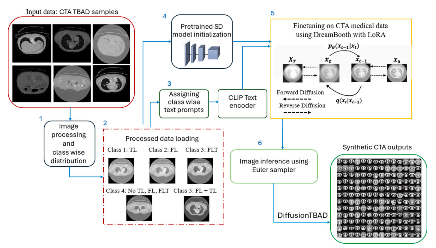

# DiffusionTBAD: Synthetic CTA Images for Type B Aortic Dissection


**DiffusionTBAD** is a curated dataset of *synthetic* CT angiography (CTA) images focused on **Type B Aortic Dissection (TBAD)**. All images are generated using **text-to-image diffusion models**, providing a resource for advancing research in medical imaging, anomaly detection, and synthetic data augmentation.

---

## 🧠 About the Data

- **Image Size**: 512 × 512 pixels  
- **Sampling Methods**: Euler, Euler A  
- **Image Count**: 1600 per class  
- **Modality**: Synthetic CT Angiography  
- **Condition**: Type B Aortic Dissection (TBAD)

This dataset is best suited for:
- Training and evaluating deep learning models for TBAD
- Exploring generative diffusion models in radiology
- Augmenting real-world CTA datasets with rare pathological examples

---

## 📦 Model Download

You can download the fine-tuned DreamBooth model and example data here:

- 🔗 [**Download DreamBooth Model (HuggingFace)**](https://huggingface.co/AymanAbaid/DiffusionTBAD)  
- 📁 [**Sample Dataset (ZIP)**](https://www.kaggle.com/datasets/aymanabaid/diffusiontbad)

---

## 🚀 How to Use the Tuned DreamBooth Model

To replicate or extend the dataset generation, follow these steps:


## 📌 Citing this Dataset

If you find our work useful for your research, please cite:
```bibtex
@INPROCEEDINGS{diffustionTBAD_EMBC,
  author={Abaid, Ayman and Ali Farooq, Muhammad and Hynes, Niamh and Corcoran, Peter and Ullah, Ihsan},
  booktitle={2024 46th Annual International Conference of the IEEE Engineering in Medicine and Biology Society (EMBC)}, 
  title={Synthesizing CTA Image Data for Type-B Aortic Dissection using Stable Diffusion Models},
  doi={10.1109/EMBC53108.2024.10782969}
}

@article{abaid2026diffusiontbad,
  title={DiffusionTBAD: Rendering CTA images for type B aortic dissection diagnosis},
  author={Abaid, Ayman and Farooq, Muhammad Ali and Hynes, Niamh and Corcoran, Peter and Ullah, Ihsan},
  journal={Computerized Medical Imaging and Graphics},
  pages={102740},
  year={2026},
  publisher={Elsevier}
}
```


📫 Contact
For questions, dataset access, or collaborations, please contact:
a.abaid1@universityofgalway.ie
muhammadali.farooq@universityofgalway.ie


